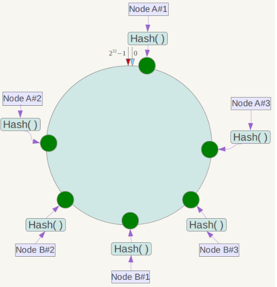

<!-- TOC depthFrom:1 depthTo:6 withLinks:1 updateOnSave:1 orderedList:0 -->

- [笔记](#笔记)
	- [知识点](#知识点)
		- [六 哈希函数和哈希表](#六-哈希函数和哈希表)
			- [1 常用哈希算法有：](#1-常用哈希算法有)
			- [2 哈希表](#2-哈希表)
	- [算法题 解法](#算法题-解法)
	- [关于面试](#关于面试)
	- [语言碎片](#语言碎片)

<!-- /TOC -->

# 笔记

## 知识点
1 代码简洁 -> 常数项低  (-> means imply)


2 实际工程、应用中，为什么不使用递归函数？

-   递归栈 （overflow，深度不定）
-

3 编码 - 解码 （物理结构 - 逻辑结构）

“一个东西本身，有很多种诠释的角度” （一个物理结构，可以模拟多种逻辑结构。换一个诠释的角度，解释规则）

4 排序的稳定性 及 排序稳定性的意义


5 工程中的综合排序算法

```
if N < 60 etc:
    insert_sort()
else:
    if basic data type:  # (don't need consider sort's stable)
        quicksort()
    else:  # complex type (need sort stable)
        merge_sort()
```

### 六 哈希函数和哈希表

#### 1 常用哈希算法有：
*   加密方面有 MD5,SHA.
*   查找哈希算法：lookup3，Murmur3，FarmHash

[更多关于哈希函数介绍和比较](http://www.alloyteam.com/2017/05/hash-functions-introduction/)

哈希函数的性质：

一个函数H(X)=Y被称为Hash函数，iff

* 随机性：输出Y是均匀分布的
* 单向性：给定Y求X是不可行的
* 无爪性：无法有效找到不同X1,X2，使得H(X1)=H(X2)
* 有效性：能够快速计算


#### 2 哈希表

哈希表的 增删改查的平均时间复杂度是 O(1)的 （虽然有扩容代价等，但应用众多实现上的优化技巧以及从长期来看，是 O(1)的）

哈希表分类，主要根据的是表处理冲突的方法种类。

所谓经典结构就是，H(key1) == H(key2) 的时候，我们在同一个地址上将他们连起来，组成链表结构。

具体实现，还有其他补充细节，以 Java 中的为例，见 [Java HashMap工作原理及实现](https://yikun.github.io/2015/04/01/Java-HashMap%E5%B7%A5%E4%BD%9C%E5%8E%9F%E7%90%86%E5%8F%8A%E5%AE%9E%E7%8E%B0/)

**HashMap 的内部实现**

见 [Java HashMap工作原理及实现](https://yikun.github.io/2015/04/01/Java-HashMap%E5%B7%A5%E4%BD%9C%E5%8E%9F%E7%90%86%E5%8F%8A%E5%AE%9E%E7%8E%B0/)
以及 [Java 8系列之重新认识HashMap](https://tech.meituan.com/java-hashmap.html)

关键词：装填因子，容量，链地址法（红黑树），扩容操作（耗时）

**红黑树**

以下摘抄自 https://tech.meituan.com/redblack-tree.html

产生背景
> 因为搜索二叉树（bst）存在倾斜的问题，一种新的树——平衡二叉查找树(Balanced BST)产生了。平衡树在插入和删除的时候，会通过旋转操作将高度保持在logN。其中两款具有代表性的平衡树分别为AVL树（在AVL树中任何节点的两个子树的高度最大差别为1）和红黑树。AVL树由于实现比较复杂，而且插入和删除性能差，在实际环境下的应用不如红黑树。

小结
> 作为平衡二叉查找树里面众多的实现之一，红黑树无疑是最简洁、实现最为简单的。红黑树通过引入颜色的概念，通过颜色这个约束条件的使用来保持树的高度平衡。作为平衡二叉查找树，旋转是一个必不可少的操作。通过旋转可以降低树的高度，在红黑树里面还可以转换颜色。

> 红黑树里面的插入和删除的操作比较难理解，这时要注意记住一点：操作之前红黑树是平衡的，颜色是符合定义的。在操作的时候就需要向兄弟节点、父节点、侄子节点借调和互换颜色，要达到这个目的，就需要不断的进行旋转。所以红黑树的插入删除操作需要不停的旋转，一旦借调了别的节点，删除和插入的节点就会达到局部的平衡（局部符合红黑树的定义），但是被借调的节点就不会平衡了，这时就需要以被借调的节点为起点继续进行调整，直到整棵树都是平衡的。在整个修复的过程中，插入具体的分为3种情况，删除分为4种情况。

> 整个红黑树的查找，插入和删除都是O(logN)的，原因就是整个红黑树的高度是logN，查找从根到叶，走过的路径是树的高度，删除和插入操作是从叶到根的，所以经过的路径都是logN。

红黑树插入、删除操作的具体操作流程以后再看（不看或许也可以？）

红黑树的介绍，还可见 https://github.com/julycoding/The-Art-Of-Programming-By-July/blob/master/ebook/zh/03.01.md


#### 布隆过滤器 （应用）

**很好的介绍**
见[数学之美-吴军](https://china.googleblog.com/2007/07/bloom-filter_7469.html)
这里关于布隆过滤器应用的前因后果都有提及。

关键点：

在一个集合中查找、过滤（如判断一个电子邮件地址是否在黑名单列表中，是则不给它群发邮件。Gmail 应用场景）

直接用一个哈希表，会有存储空间的问题（列表实在是太大了，几亿级别上的），所以改用 比特数组 + k 个哈希函数，标记时（ hashcode % len（比特数组长度））。

公式结论：

n： 样本总量
m： 比特数组长度（几亿）
k： 哈希函数的个数
P： 错误率

首先确定允许的预期错误率e，然后用 $ m = \frac{-lnP * n}{(ln2)^2} $，然后计算需要的哈希函数个数 $ k = ln2 * (m/n) $ (注意 m，k 的计算结果均向上取整)
最后，重新计算因为取整带来的错误率调整，$ P = (1 - e^{(-n*k)/m})^k $ (计算出的 P 会比预期给出的错误率小)

布隆过滤器的空间使用率大概为50%左右


#### 一致性哈希技术

常见应用场景：分布式，负载均衡

> 一、问题产生背景
>
> 在使用分布式对数据进行存储时，经常会碰到需要新增节点来满足业务快速增长的需求。然而在新增节点时，如果处理不善会导致所有的数据重新分片，这对于某些系统来说可能是灾难性的。
> 那么是否有可行的方法，在数据重分片时，只需要迁移与之关联的节点而不需要迁移整个数据呢？当然有，在这种情况下我们可以使用一致性Hash来处理。
>
> 二、一致性Hash算法背景
>
> 一致性哈希算法在1997年由麻省理工学院的Karger等人在解决分布式Cache中提出的，设计目标是为了解决因特网中的热点(Hot spot)问题，初衷和CARP十分类似。一致性哈希修正了CARP使用的简单哈希算法带来的问题，使得DHT可以在P2P环境中真正得到应用。
> [摘自](http://www.cnblogs.com/moonandstar08/p/5361453.html)

记忆关键词：圈，顺时针最近，虚拟节点，

> 此时必然造成大量数据集中到Node A上，而只有极少量会定位到Node B上。为了解决这种数据倾斜问题，一致性哈希算法引入了虚拟节点机制，即对每一个服务器节点计算多个哈希，每个计算结果位置都放置一个此服务节点，称为虚拟节点。具体做法可以在服务器ip或主机名的后面增加编号来实现。例如上面的情况，可以为每台服务器计算三个虚拟节点，于是可以分别计算 “Node A#1”、“Node A#2”、“Node A#3”、“Node B#1”、“Node B#2”、“Node B#3”的哈希值，于是形成六个虚拟节点：
>
> 同时数据定位算法不变，只是多了一步虚拟节点到实际节点的映射，例如定位到“Node A#1”、“Node A#2”、“Node A#3”三个虚拟节点的数据均定位到Node A上。这样就解决了服务节点少时数据倾斜的问题。在实际应用中，通常将虚拟节点数设置为32甚至更大，因此即使很少的服务节点也能做到相对均匀的数据分布。如图所示！
>
> 
[http://www.cnblogs.com/moonandstar08/p/5361453.html](http://www.cnblogs.com/moonandstar08/p/5361453.html)

一致性哈希算法的其他讲解，还可见 [july的博文](https://wizardforcel.gitbooks.io/the-art-of-programming-by-july/content/a.3.html)


--------
## 算法题 解法

1 第二数学归纳法，**寻找解决问题的结构**。比如 分圈结构（题目 printmatrix，revolve_square）

2 最优解来自： 数据状况（输入数据分布）+ 要求的问题特殊

3 边界问题，都是 coding 细节，需要你实际去练习，去做


--------
## 关于面试

1.  轻量级的题目，看你是否有基本的 coding 能力
2.  面试，要尽可能去寻找最优解，这是和机试 AC 题目很不一样的；更好的解法，竞争
3.  和面试官聊只有一个目的，让他喜欢你思考问题的方式
4.  笔试只要尽快过掉就好，面试会什么就得彻底嘚瑟出来


--------
## 语言碎片
1 把你野马一般的思绪收回来


--------
